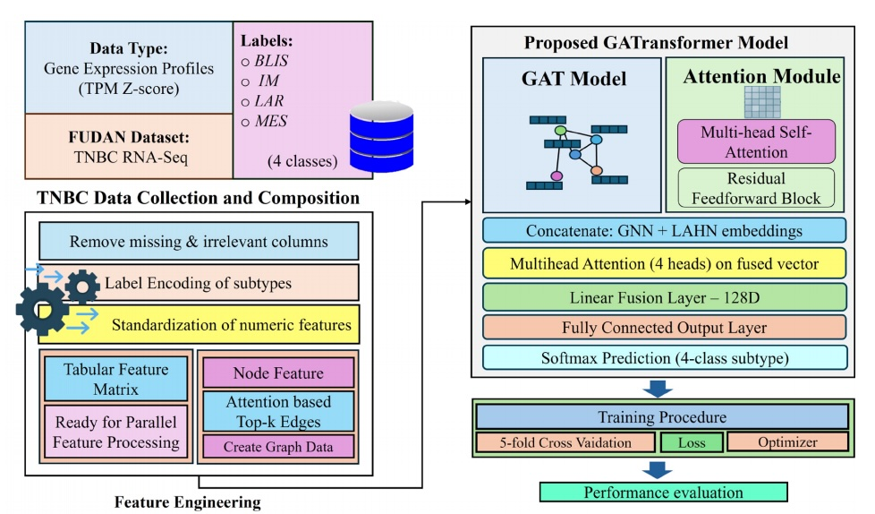
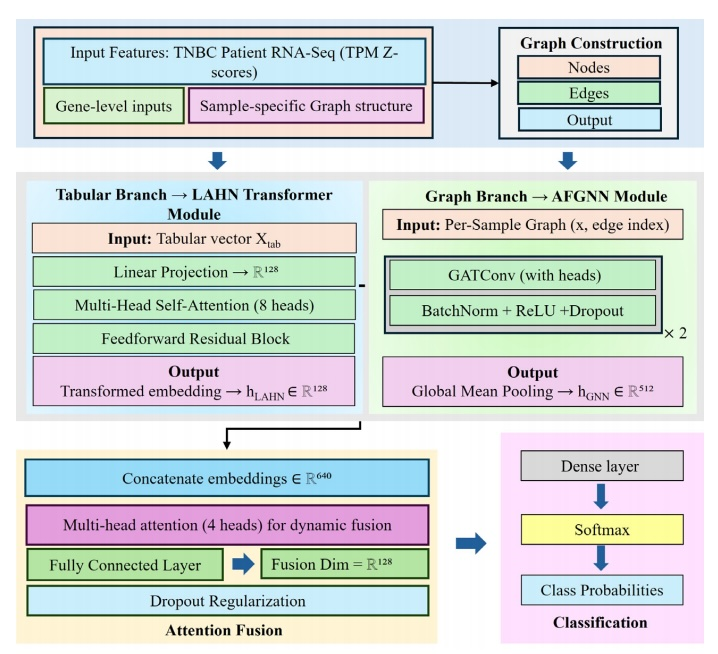
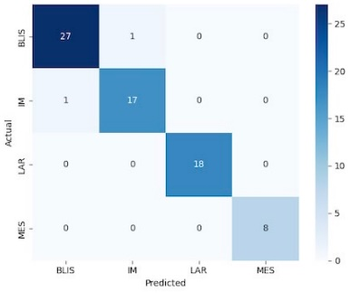
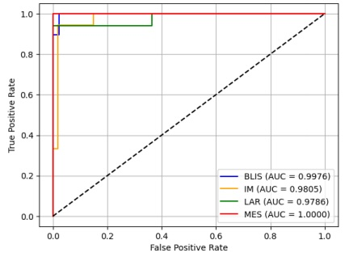

# GAT-TNBC-Net: Graph-Attentive Dual Branch Network for Subtype Prediction of Triple-Negative Breast Cancer from Transcriptomic Data

**Hitesh Reddy Dereddy**¹  |  **Rakesh Chandra Joshi**²  |  **Pavel Sikora**³  
¹Dept. of AI, ASET, Amity University Uttar Pradesh, Noida, India  
²Amity Centre for Artificial Intelligence, Amity University Uttar Pradesh  
³Dept. of Telecommunications, FEEC, Brno University of Technology, Czech Republic  

**Contact:** dereddy.reddy@s.amity.edu | rakeshchandraindia@gmail.com

---

### Abstract

Triple-Negative Breast Cancer (TNBC) is a highly aggressive and clinically heterogeneous subtype of breast cancer...  
We propose **GAT-TNBC-Net**, a dual-branch attention-based neural architecture that achieves **97.22% test accuracy** and **92.22% average cross-validation accuracy** on the FUSCC TNBC dataset (360 patients, 55,662 genes), significantly outperforming traditional ML and deep learning baselines.

**Keywords:** Triple-Negative Breast Cancer, RNA-Sequence Classification, Graph Neural Network, Attention Mechanism, Transcriptomics

---

### Full Text (Extracted from Paper)

#### I. DATA AND PREPROCESSING
- **Dataset:** FUSCC TNBC cohort [Chen et al., 2022](https://doi.org/10.1038/s41597-022-01681-z)  
- **Samples:** 360 annotated tumors  
- **Genes:** 55,662 (hg38, TPM → Z-score)  
- **Subtypes:**  
  - LAR: 80  
  - IM: 85  
  - BLIS: 145  
  - MES: 50  

Preprocessing: `fastp → HISAT2 → featureCounts → TMM → log₂ → Z-score`

#### II. PROPOSED METHODOLOGY – GAT-TNBC-Net
Dual-branch architecture with patient-specific graph construction.

### Key Figures

**Fig 1.** Block diagram of proposed methodology  
**Fig 2.** GAT-TNBC-Net architecture (GAT + LAHN + Fusion)  
**Fig 3.** Confusion Matrix
**Fig 4.** ROC 





 

---

### Results

#### Table I: Classification Report (Best Performing Fold)

| Class   | Precision | Recall | F1-Score | Support |
|---------|-----------|--------|----------|---------|
| BLIS    | 0.97      | 1.00   | 0.98     | 29      |
| IM      | 0.94      | 0.94   | 0.94     | 18      |
| LAR     | 1.00      | 0.94   | 0.97     | 17      |
| MES     | 1.00      | 1.00   | 1.00     | 8       |
| **Accuracy** |       |        | **0.97**     | 72      |
| **Macro Avg** | 0.98  | 0.97   | 0.97     | 72      |
| **Weighted Avg** | 0.97 | 0.97 | 0.97 | 72 |

#### Table II: Performance Comparison of Baselines

| Model Variant       | 5-Fold CV Acc. (%) | Best Fold Accuracy (%) | Precision | Recall | F1 Score |
|---------------------|--------------------|-------------------------|-----------|--------|----------|
| Random Forest       | 90.00              | 94.44                   | 0.95      | 0.93   | 0.94     |
| LGBM                | 90.83              | 94.22                   | 0.96      | 0.93   | 0.94     |
| XGBoost             | 90.08              | 95.36                   | 0.95      | 0.95   | 0.95     |
| SVM (poly)          | 40.83              | 44.34                   | 0.73      | 0.31   | 0.26     |
| GAT                 | 40.00              | 44.32                   | 0.18      | 0.27   | 0.19     |
| **Proposed Model**  | **92.22**          | **97.22**               | **0.98**  | **0.97**| **0.97** |

> **Inference Speed:** 0.0878 ms/sample → **11,392 samples/second** (A100 GPU)

#### Table III: Comparison with Existing Studies

![Table III: Literature Comparison]

| Study                  | Data Type        | Methodology                            | Subtypes       | Performance         | Remarks |
|------------------------|------------------|----------------------------------------|----------------|---------------------|---------|
| Akhouayri et al. (2022) | Gene expression  | ML on DEG signatures                   | Six TNBC       | Acc 88.6–89.4%      | Limited accuracy |
| Bissanum et al. (2021)  | Microarray       | SVM on 719 DEGs                        | BLIA, BLIS, MES, LAR | Acc 95%       | No relational context |
| Bakr et al. (2023)      | Genomic + CT     | K-means + CNN + SVM                    | BLIS, IM, LAR, MES | Acc 91.66%    | Hybrid, no deep genomic |
| **GAT-TNBC-Net (Ours)** | **Z-score RNA-seq** | **GAT + LAHN + Attention Fusion** | **BLIS, IM, LAR, MES** | **Acc 97.22%, F1 0.97** | **State-of-the-art** |

---

### Acknowledgment

This work was supported by the **OP JAK reg. no. CZ.02.01.01/00/23_021/0008829**, Czechia.

---

### Citation

```bibtex
@article{dereddy2025gat,
  title        = {GAT-TNBC-Net: Graph-Attentive Dual Branch Network for Subtype Prediction of Triple-Negative Breast Cancer from Transcriptomic Data},
  author       = {Dereddy, Hitesh Reddy and Joshi, Rakesh Chandra and Riha, Kamil and Dutta, Malay Kishore and Sikora, Pavel},
  year         = 2025,
}
